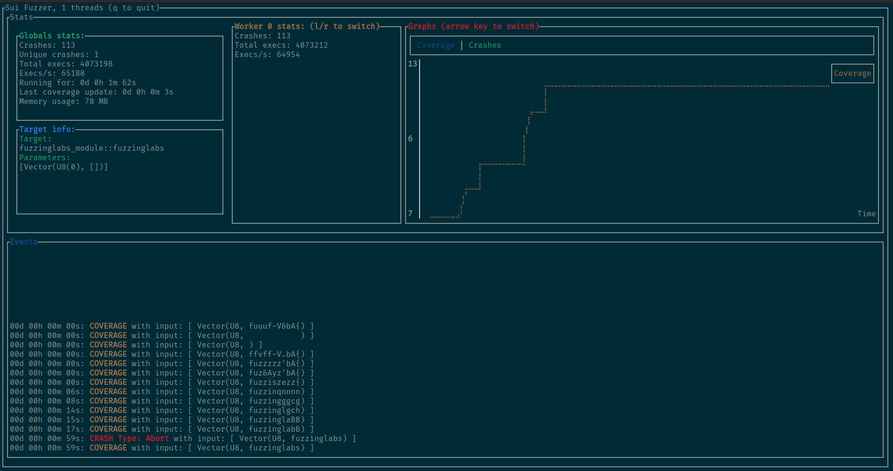

# Sui Fuzzer (WIP)

Fuzzer for Sui Move Smart Contracts.



## Milestones

### Milestone 1: Discovery & project architecture
- [x] Testing and analysis of Sui Move and VM internals 
- [x] Development of the project base (architecture and command line interface)
- [x] Tutorial for project installation and testing
- [x] Identification of arguments and contracts execution requirements
- [x] Creation MVP

### Milestone 2: Fuzzer improvements
- [x] Improvement of the project (threading, runtimes perf monitoring)
- [x] Implementation of coverage-guided fuzzing
- [x] Implementation of vulnerability detectors
- [x] Add support for property testing methods
- [x] Docker and packaging of the fuzzer as a library
- [x] Tutorial for running fuzzers and using advanced CLI options

### Milestone 3: Fuzzer finalization
- [x] Generation of sequences of calls (stateful fuzzing)
- [x] Improvement of contract argument generation (based on )
- [x] Improvement of command line options
- [x] Improvement of the fuzzing (input file sharing, mutation algorithm, speed)
- [ ] Create more documentation & tutorials against basic/example contracts

## Usage

You need to clone the repository with the submodules using the following command:

```bash
$ git clone --recursive git@github.com:FuzzingLabs/sui-fuzzer.git
```
#### In stateless

To run the fuzzer just use (with rust and cargo installed):

```bash
$ make CONFIG_PATH="./config.json" TARGET_MODULE="fuzzinglabs_module" TARGET_FUNCTION="fuzzinglabs"
```

You need to have a compiled SuiMove module path in the *contract* item in the config.

#### In stateful


To run the fuzzer just use (with rust and cargo installed):

```bash
$ make CONFIG_PATH="./config.json" TARGET_MODULE="calculator_module" TARGET_FUNCTIONS="add,sub"
```

You need to have a package path in the *contract* item in the config.

#### Configuration

Here is an example of config:

```json
{
  "use_ui": true, // Do you want the nice UI or not ?
  "nb_threads": 8, // The number of threads used by the fuzzer
  "seed": 4242, // The inital seed
  "contract": "./examples/fuzzinglabs_package/build/fuzzinglabs_package/bytecode_modules/fuzzinglabs_module.mv", // The path to the compiled module / package
  "execs_before_cov_update": 10000, // When the coverage is shared between the threads (don't modify if you don't know why)
  "corpus_dir": "./corpus", // Path to where the corpus will be written (milestone 3)
  "crashes_dir": "./crashes", // Path to where the crashfiles will be written
  "fuzz_functions_prefix": "fuzz_" // Fuzzing functions prefix (can be listed by the fuzzer)
}
```

> You can find more information on how to use the fuzzer in **./doc/how_to_use_stateless.md** and in **./doc/how_to_use_stateful.md** .

## Using Docker

You can also use the provided **docker_run.sh** script to launch it in a container, use the same arguments for the script as for the Makefile (Documentation in **./doc/how_to_use_stateless.md** and **./doc/how_to_use_stateful.md**).

```bash
$ ./docker_run.sh CONFIG_PATH="./config.json" TARGET_MODULE="fuzzinglabs_module" TARGET_FUNCTION="fuzzinglabs"
```
