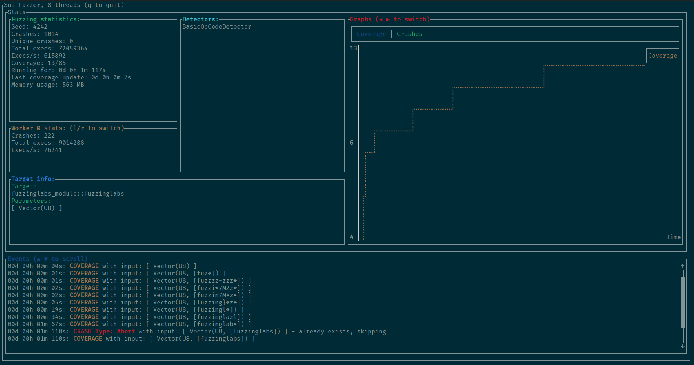

# Sui Fuzzer (WIP)

Fuzzer for Sui Move Smart Contracts.



## Milestones

### Milestone 1: Discovery & project architecture
- [x] Testing and analysis of Sui Move and VM internals 
- [x] Development of the project base (architecture and command line interface)
- [x] Tutorial for project installation and testing
- [x] Identification of arguments and contracts execution requirements
- [x] Creation MVP

### Milestone 2: Fuzzer improvements
- [x] Improvement of the project (threading, runtimes perf monitoring)
- [x] Implementation of coverage-guided fuzzing
- [ ] Implementation of vulnerability detectors
- [ ] Add support for property testing methods
- [ ] Docker and packaging of the fuzzer as a library
- [ ] Tutorial for running fuzzers and using advanced CLI options

### Milestone 3: Fuzzer finalization
- [ ] Generation of sequences of calls (stateful fuzzing)
- [ ] Improvement of contract argument generation (based on )
- [ ] Improvement of command line options
- [ ] Improvement of the fuzzing (input file sharing, mutation algorithm, speed)
- [ ] Create more documentation & tutorials against basic/example contracts

## Usage

### Important

Since the fuzzer is still a work in progress, you must use the provided *Dockerfile* to test it.

```bash
$ ./docker_run.sh
```

You need to clone the repository with the submodules using the following command:

```bash
$ git clone --recursive git@github.com:FuzzingLabs/sui-fuzzer.git
```

To run the fuzzer just use (with rust and cargo installed):

```bash
$ make CONFIG_PATH="./config.json" TARGET_FUNCTION="fuzzinglabs"
```

You need to have a compiled SuiMove module path in the *runner_parameter* item in the config.

Here is an example of config:

```json
{
  "use_ui": true,
  "nb_threads": 8,
  "seed": 4242,
  "contract_file": "./fuzzinglabs_package/build/fuzzinglabs_package/bytecode_modules/fuzzinglabs_module.mv",
  "execs_before_cov_update": 10000,
  "corpus_dir": "./corpus", // Not implemented yet
  "crashes_dir": "./crashes" // Not implemented yet
}
```
