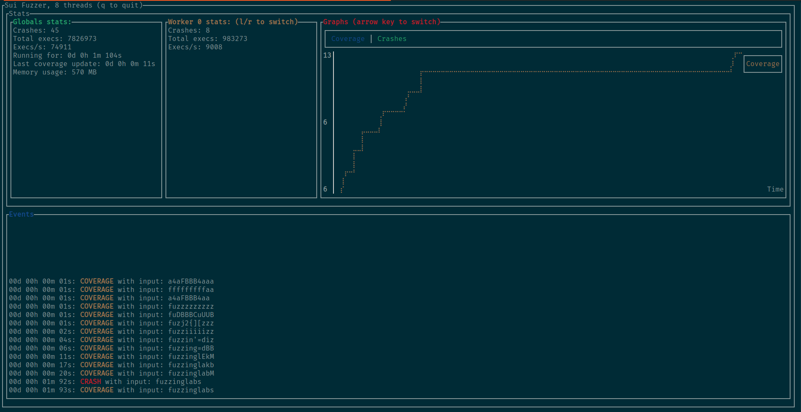

# Sui Fuzzer

Fuzzer for SuiMove smartcontracts.



## Usage

You need to clone the repository with the submodules using the following command:

```bash
$ git clone --recursive git@github.com:FuzzingLabs/sui-fuzzer.git
```

To run the fuzzer just use (with rust anf cargo installed):

```bash
$ make CONFIG_PATH="./config.json" TARGET_FUNCTION="fuzzinglabs"
```

You need to have a compiled SuiMove module path in the *runner_parameter* item in the config.

Here is an example of config:

```json
{
  "use_ui": true,
  "nb_threads": 8,
  "seed": 4242,
  "runner_parameter": "./fuzzinglabs_package/build/fuzzinglabs_package/bytecode_modules/fuzzinglabs_module.mv",
  "execs_before_cov_update": 10000,
  "corpus_dir": "./corpus", // Not implemented yet
  "crashes_dir": "./crashes" // Not implemented yet
}
```
