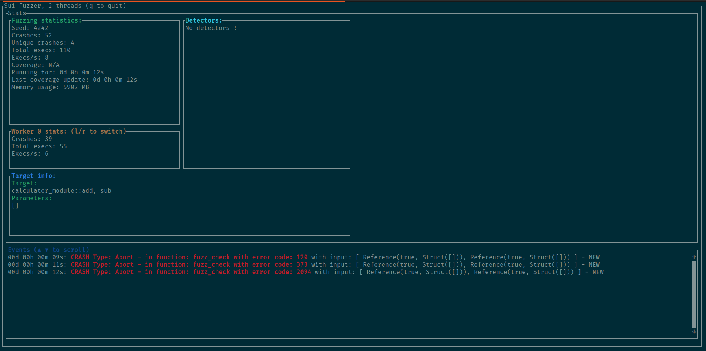

# How to use the Fuzzer

Using the fuzzer is quite simple. You just need Rust, a SuiMove package and to configure the fuzzer.

## Requirements

You'll need the latest version of **Rust** to run the fuzzer. We recommend using [Rustup](https://rustup.rs/) to install it.

## Steps

Before you can start the fuzzer, you need to prepare a few things, the **calculator** package will be used as an example in this documentation.

### 1. Compile the SuiMove package you want to fuzz

In stateful mode, the package is compiled by the fuzzer.

### 2. Configuring the fuzzer

Now, you'll need to tell the fuzzer where to find the package that you want to fuzz and configure a few parameters.

To do so you need to edit the *config.json* file (or create a new file) located at the root of the repository.

```json
{
  "use_ui": true, // Do you want the nice UI or not ?
  "nb_threads": 2, // The number of threads used by the fuzzer
  "seed": 4242, // The inital seed
  "contract_file": "./examples/calculator_package", // The path to the package
  "execs_before_cov_update": 10000, // When the coverage is shared between the threads (don't modify if you don't know why)
  "corpus_dir": "./corpus", // Path to where the corpus will be written (milestone 3)
  "crashes_dir": "./crashes", // Path to where the crashfiles will be written
  "fuzz_functions_prefix": "fuzz_", // Fuzzing functions prefix (can be listed by the fuzzer)
  "max_call_sequence_size": 5 // Maximum size of a generated call sequence (only for stateful fuzzing)
}
```
Edit the file to meet your needs.

### 3. Start the fuzzer

You can now start the fuzzer ! It can be done using this command:

```bash
$ make CONFIG_PATH="./config.json" TARGET_MODULE="fuzzinglabs_module" TARGET_FUNCTIONS="add,sub"
```

The fuzzer will automatically add every functions that starts with *fuzz_functions_prefix* to the generated call sequence and the functions listed in the *TARGET_FUNCTIONS* parameter (separated with a **,**).

You should get something like this (if **use_ui** is set to **true**):


